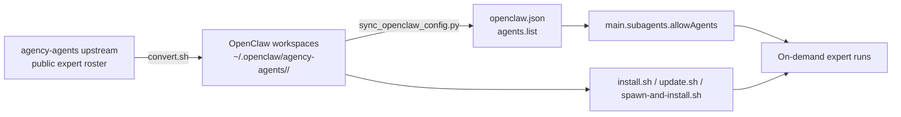

# agencyteam — An expert orchestration framework for OpenClaw

[](https://github.com/siubing05/agencyteam-openclaw/actions/workflows/ci.yml) [](https://github.com/siubing05/agencyteam-openclaw/releases) [](https://github.com/siubing05/agencyteam-openclaw/commits/master)

🌐 **English** | [简体中文](README.zh-CN.md) | [繁體中文](README.zh-TW.md) | [日本語](README.ja.md) | [한국어](README.ko.md)

`agencyteam` turns specialist agent workspaces into a reproducible expert orchestration workflow for OpenClaw.

It helps you build practical multi-agent workflows for code review, security review, architecture feedback, product critique, prompt engineering, and other AI agent automation tasks without hand-wiring every specialist yourself.

`agency-agents` refers to the upstream public expert roster from [`msitarzewski/agency-agents`](https://github.com/msitarzewski/agency-agents), which `agencyteam` converts into OpenClaw-ready workspaces and installable specialists.

It is designed for:
- parallel specialist reviews
- builder/reviewer splits
- code + security + product synthesis
- on-demand expert installation from the [`agency-agents`](https://github.com/msitarzewski/agency-agents) upstream roster
- repeatable agent routing and expert workflow automation for OpenClaw

## What it does

- converts supported upstream expert prompts into OpenClaw workspaces under `~/.openclaw/agency-agents/<agent-id>/`
- registers those experts in `agents.list`
- preserves non-agency agents already present in your config
- merges installed expert IDs into `main.subagents.allowAgents` (and preserves an existing `['*']` wildcard if you already use one)
- provides scripts for install, update, and on-demand spawn
- pins the default upstream source revision via `UPSTREAM_REF` for reproducible installs
- includes GitHub Actions smoke testing for script regressions

Built for teams that want faster multi-expert execution without giving up deterministic installs, safer config sync, or clean OpenClaw integration.

## How it fits together



- `convert.sh` transforms upstream expert prompts into a staged snapshot of local OpenClaw workspaces
- `install.sh` syncs that staged snapshot into the live workspace root, then registers selected experts and updates `main.subagents.allowAgents`
- `update.sh` refreshes generated experts from a staged snapshot while preserving non-agency agents in your config
- `spawn-and-install.sh` repairs a missing or unhealthy expert from a staged snapshot before launching the workflow

## Common use cases

- run parallel code review, security review, and architecture review on the same repo
- split builder and reviewer roles across specialist agents for safer implementation loops
- install expert personas on demand instead of preloading a large agent roster manually
- create reusable AI workflow patterns for engineering, product, design, QA, and growth work
- orchestrate prompt engineering and system prompt review with distinct expert perspectives
- build OpenClaw automation flows that stay reproducible across installs, updates, and gateway restarts
- support solo builders who want an "AI team" feel without maintaining complex custom routing by hand

## Requirements

- `openclaw`
- `git`
- `python3`

## Quick start

```bash
git clone https://github.com/siubing05/agencyteam-openclaw.git \
  ~/.openclaw/workspace/skills/agencyteam

cd ~/.openclaw/workspace/skills/agencyteam
./scripts/install.sh
```

## Install options

Install all supported experts:

```bash
./scripts/install.sh
# or
./scripts/install.sh --all
```

Install only specific experts:

```bash
./scripts/install.sh --agents "engineering-code-reviewer engineering-security-engineer design-ui-designer"
```

## Pinned upstream policy

By default, conversion uses the commit recorded in `UPSTREAM_REF`.

- this makes installs reproducible
- this narrows supply-chain drift compared with tracking `main` implicitly
- you can override it deliberately with `AGENCYTEAM_UPSTREAM_REF=<tag-or-commit>` or `./scripts/convert.sh --ref <tag-or-commit>`

## What the installer actually does

1. clones the upstream `agency-agents` repo to a temporary directory
2. converts supported categories into OpenClaw workspaces
3. syncs matching entries into `agents.list`
4. merges installed IDs into `main.subagents.allowAgents`
5. creates a timestamped backup of `openclaw.json`
6. restarts the gateway and waits for it to respond

## Update workflow

Preview upstream changes without writing anything:

```bash
./scripts/update.sh --dry-run
```

Apply upstream changes:

```bash
./scripts/update.sh
```

Also remove agencyteam-managed agents that disappeared upstream:

```bash
./scripts/update.sh --prune-removed
```

### Important update behavior

- `update.sh` refreshes generated `AGENTS.md` files from upstream
- if you manually edited generated files under `~/.openclaw/agency-agents/`, an update can overwrite those edits
- non-agency agents in your config are preserved
- `--prune-removed` is opt-in so removals are explicit
- prune flows only remove directories marked with `AGENCYTEAM_MANAGED`; unrelated local directories under the same root are left alone
- config sync fail-fast validates malformed `main.subagents.allowAgents` values instead of silently dropping bad entries

## On-demand installation + spawn

If you want to use one expert immediately and install it if missing:

```bash
./scripts/spawn-and-install.sh engineering-code-reviewer "Review this repository for correctness and maintainability" --timeout 600
```

## Verify

```bash
openclaw agents list
openclaw gateway status
```

## Advanced environment overrides

```bash
AGENCY_DEST=/tmp/agency-agents ./scripts/install.sh --agents "engineering-code-reviewer"
OPENCLAW_CONFIG_PATH=/tmp/openclaw.json ./scripts/update.sh --dry-run
AGENCYTEAM_UPSTREAM_REF=<tag-or-commit> ./scripts/install.sh
./scripts/convert.sh --ref <tag-or-commit>
```

## Suggested public positioning

Use `agencyteam` when you want OpenClaw to behave like a small expert panel instead of a single generalist assistant.

## CI

GitHub Actions runs `.github/workflows/ci.yml`, which performs:
- bash syntax checks
- python syntax checks
- a deterministic local smoke test with a fake `openclaw` shim and local upstream git repo

See also:
- `SKILL.md`
- `references/routing.md`
- `references/workflows.md`
